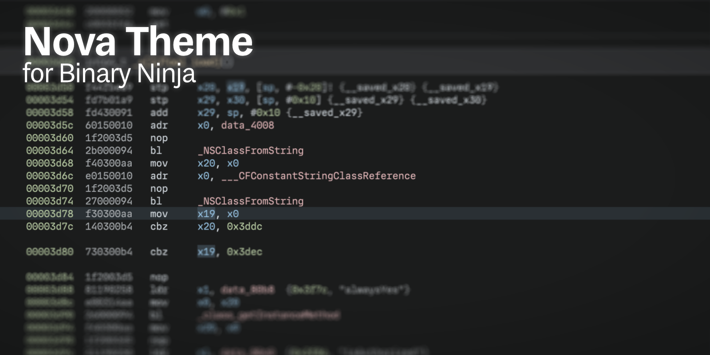

# Nova Theme

## Installation

This theme uses stylesheets to a considerable extent, and therefore utilizes a
small "assembly pipeline"; complete theme files are not included in the
repository. You must either assemble the theme yourself or download a
pre-assembled file from the releases page.

## Building

The assembly script is written in Ruby and depends on the
[`sassc`](https://github.com/sass/sassc-ruby/) gem. Simply run the `assemble.rb`
script after installing dependencies via `bundle install`.

## License

It's literally colors.
